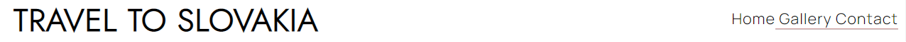
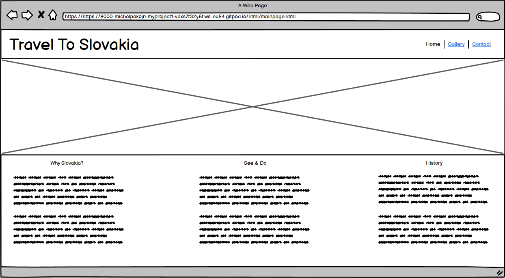
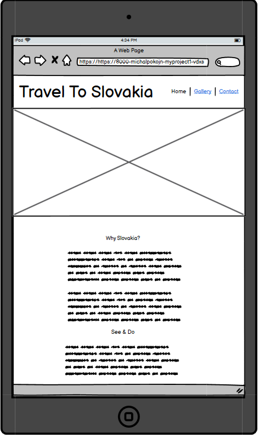
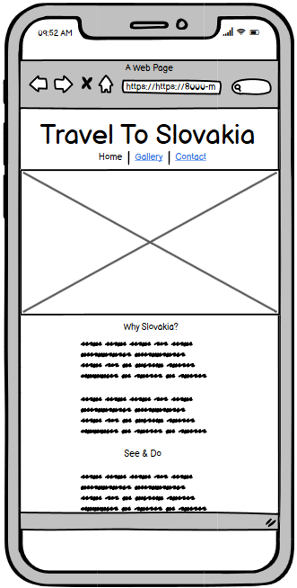
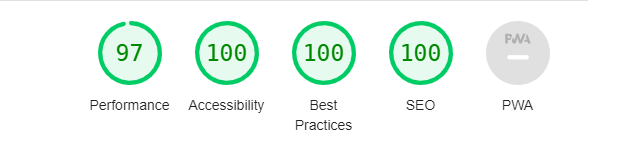

# Travel To Slovakia

This website Travel To Slovakia is about my home country Slovakia. Main purpose is saying and showing something about this country and 
making potential users to contact the owner of the website for trip bookings.
Travel To Slovakia will be useful for people who loves travelling and exploring not so popular countries such as this one. 

## User stories

- As a visiting user I want like to see the pictures of how the destination looks like so I can decide if I want to visit
- As a visiting user I would like to contact the owner of the website and book a trip

## Features

------

**Navigation**

- On the top of the every page, there is a logo on the left side that can navigate to the main page and 
  on the right side there are 3 links which can navigate to different pages such as Home - main page, Gallery - where use can find photos about Slovakia and Contact link where user can find contact and register for a trip to Slovakia.

- The navigation bar clearly tells on which page user currently is as I removed text underline on a page that is clicked on.

 

**The header**
- Banner photo with fade in effect on a main page

**The gallery section**
- The gallery section shows 3 different sections of photos where user can interact them with hover effect or click on the mobile devices.
- Each of a picture in the gallery section has a hover effect with small zoom in effect.

**The contact section**
- The contact section include simple register form for upcoming trips that collect details of potential customers and other requests.
- There is also contact details included on a page that give customers an option to get in touch.

**Social links**

- There are social links included for every page where users can find the travel agency on a Facebook, Instagram and Youtube.

## Future features

- Upgrade this website with more functions such as calendar to book trips easier

- Upgrade nav bar, make it fixed on a screen even the user scroll down the page

## Typography nad color scheme

- For main fonts I used google fonts and implemented for Headings and text
- I used font named Jost for headings and font called Manrope for basic text and form
- I chosen basic color layout for website which is white background, black text and for headings dark red color

## Wireframes

------

- Before I started to write the code I first made a plan and visual using Balsamiq wireframe

## Testing

------

- I tested this webpage on Chrome, Mozilla Firefox and Safari.

- I confirmed that this project is fully responsive, and works on every screen device using the devtools device toolbar.

- I confirmed that registration form works and require all field to be filled with correct data.

**Bugs**

**Solved bugs**

- When I first imported all the photos I used the highest resolution possible and page was loading too slow so I replaced them with appropriate resolution for desktop and mobile devices and it started to load faster.

**Validator testing**

- HTML 
-- No errors were returned when passing through the official W3C validator.
- CSS
-- No errors were found when passing through the official validator.
- Accessibility
-- I confirmed that the images, colors and fonts chosen are easy to read and accessible by running it trhough lighthouse in devtools.

**Unfixed bugs**

No unfixed bugs

## Deployment
------

## Credits
------
- Animations on main page and gallery was taken from [w3schools](w3schools.com)

**Content**
- The text on a main page about Slovakia was taken from [wikipedia](wikipedia.org)
- The code to link the social media and main logo and nav bar inspiration was taken from the [Love Running](https://code-institute-org.github.io/love-running-2.0/index.html) project at [Code Institute](https://codeinstitute.net/ie/)
- Social links logo taken from [Font Awesome](https://fontawesome.com/)

**Media**

- All the images was taken from [pxhere](https://pxhere.com/)

