# Travel To Slovakia

Travel To Slovakia is a website about my home country Slovakia. Main purpose is saying and showing something about this country and 
making potential visitors to contact the owner of the website for trip bookings.
Travel To Slovakia will be useful for people who loves travelling and exploring not so popular countries such as this one. 

  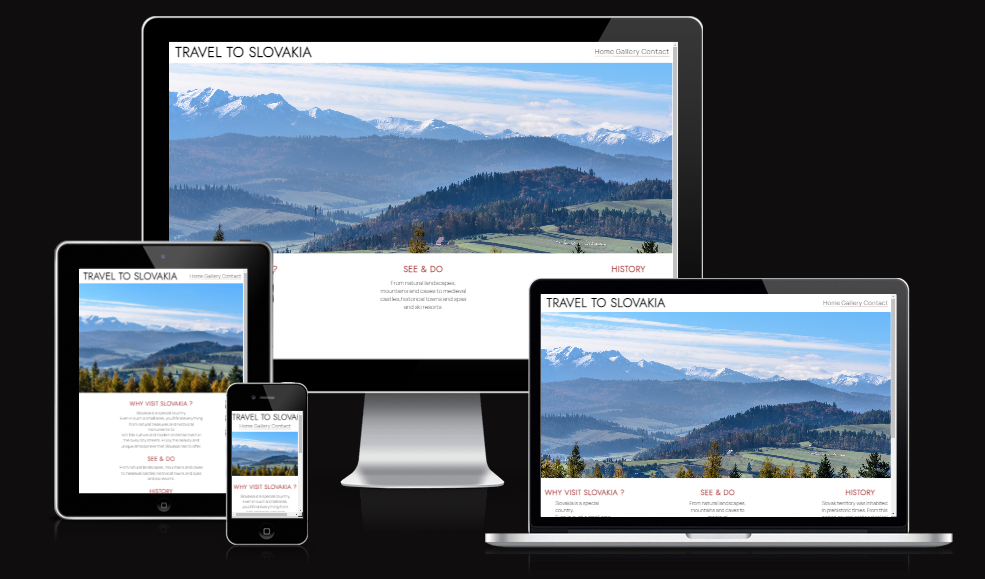

## User stories

- As a visiting user I am interested to travel to center europe and find out something about the desired destination
- As a visiting user I want like to see the pictures of how the destination looks like so I can decide if I want to visit
- As a visiting user I would like to contact the owner of the website and book a trip

## Features

------

**Navigation**

- On the top of the every page, there is a logo on the left side that can navigate to the main page and 
  on the right side there are 3 links which can navigate to different pages such as Home - main page, Gallery - where use can find photos about Slovakia and Contact link where user can find contact and register for a trip to Slovakia.

- The navigation bar clearly tells on which page user currently is as the text underline on a page that is clicked on is removed.

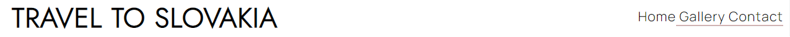 

**The header**

- Banner photo with fade in effect on a main page

**The gallery section**
- The gallery section shows 3 different sections of images where user can interact them with zoom in effect when hover on a desktop or click on the smaller devices.

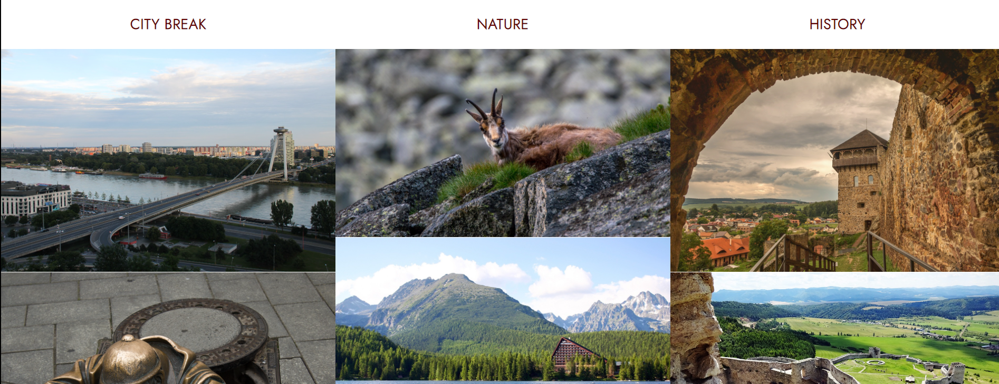 

**The contact section**
- The contact section include simple register form for upcoming trips that collect details of potential customers and other requests.
- First Name, Last name, Email address and also Requests box are required to fill if user wants to succesfully sent form.

- Submit button has a zoom in effect when hover on desktop and clicked on smaller devices.

- There is also contact details included on a page that give customers an option to get in touch.

  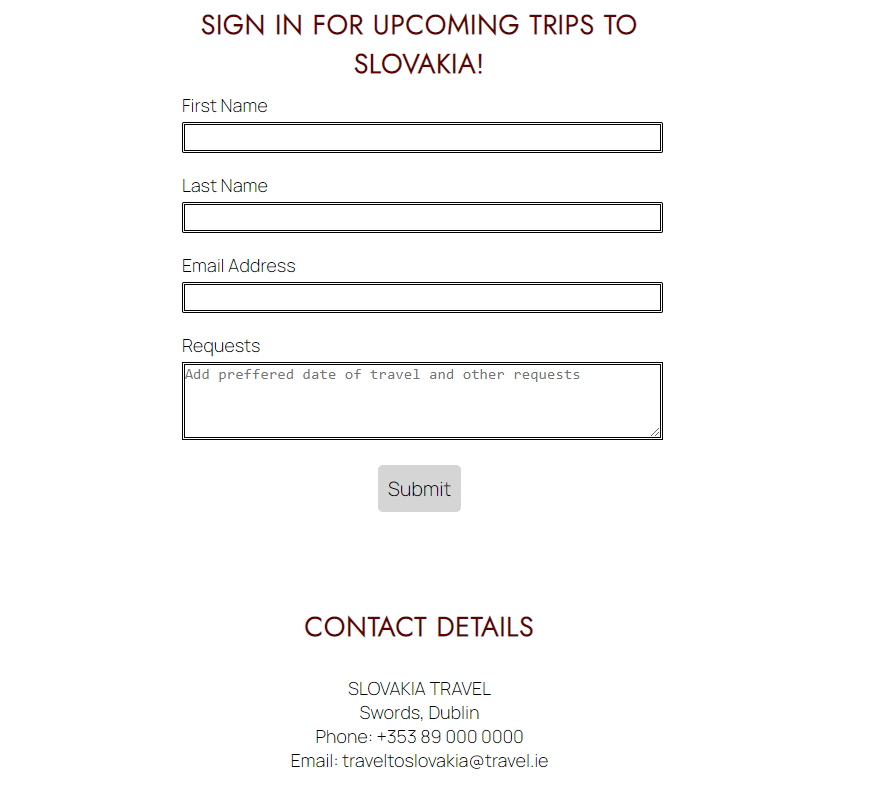

 
- Once the form is sent user will get new page open in different tab saying thank you for submit
 
 

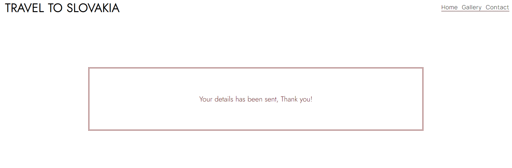 

**Footer**

- There are social links included located on every page at the bottom. User can find the travel agency on a Facebook, Instagram   and Youtube. These links are open in a new tab to keep user also on the website.
  

  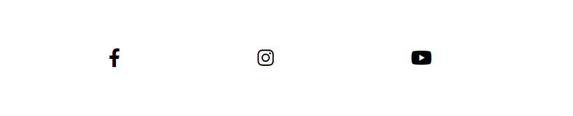

## Future features

- Upgrade this website with more functions such as calendar to book trips easier

- Upgrade nav bar, make it fixed on a screen even the user scroll down the page

## Typography and color scheme
------
### Fonts
- Fonts are taken from google fonts

- Font named Jost is used for headings and Logo

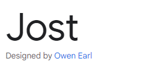

- Font named Manrope is used for main text and form

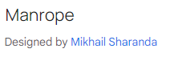

- I chosen basic color layout for website which is white background, black text and for headings dark red color

### Color

- Color palet used for website

## Wireframes

------

- For visualisation of website I used Balsamiq wireframe

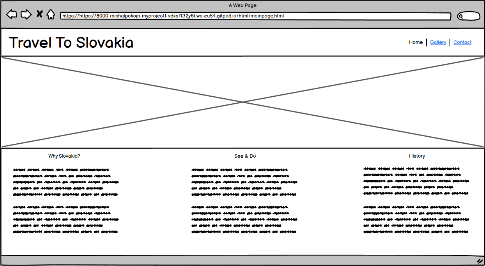
 

  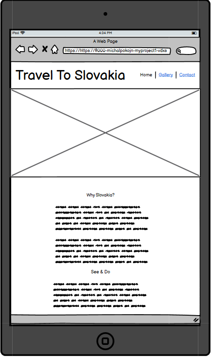

 

  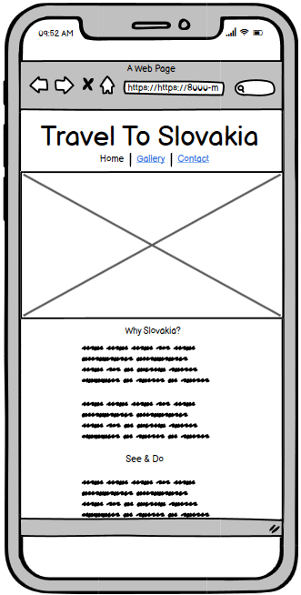

## Technologies used

------

- HTML5
- CSS3

## Testing

------

- I tested this webpage on Chrome, Mozilla Firefox and Safari.

- I confirmed that this project is fully responsive, and works on every screen device using the devtools device toolbar.

- I confirmed that registration form works and require all field to be filled with correct data.

**Bugs**

**Solved bugs**

- When I first imported all the photos I used the highest resolution possible and also made a long path to the source so page was loading too slow. I replaced them with appropriate resolution for desktop and mobile devices and it started to load faster.

**Validator testing**

- HTML 
-- No errors were returned when passing through the official W3C validator.
- CSS
-- No errors were found when passing through the official validator.
- Accessibility
-- I confirmed that the images, colors and fonts chosen are easy to read and accessible by running it trhough lighthouse in devtools.

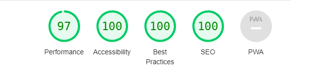

**Unfixed bugs**

No unfixed bugs

## Deployment
------

- The site was deployed to GitHub pages. The steps to deploy are as follows:

  - In the GitHub repository, navigate to the Settings tab
  - From the source section drop-down menu, select the Master Branch
  - Once the master branch has been selected, the page will be automatically refreshed with a detailed ribbon display to indicate the successful deployment.

  The live link can be found here -

## Credits
------
- Animations on main page and gallery was taken from [w3schools](w3schools.com)

**Content**
- Colors image taken from [Coolors](https://coolors.co/)
- The text on a main page about Slovakia was taken from [wikipedia](wikipedia.org)
- The code to link the social media and main logo and nav bar inspiration was taken from the [Love Running](https://code-institute-org.github.io/love-running-2.0/index.html) project at [Code Institute](https://codeinstitute.net/ie/)
- Social links logo taken from [Font Awesome](https://fontawesome.com/)

**Media**

- All the images was taken from [pxhere](https://pxhere.com/)

